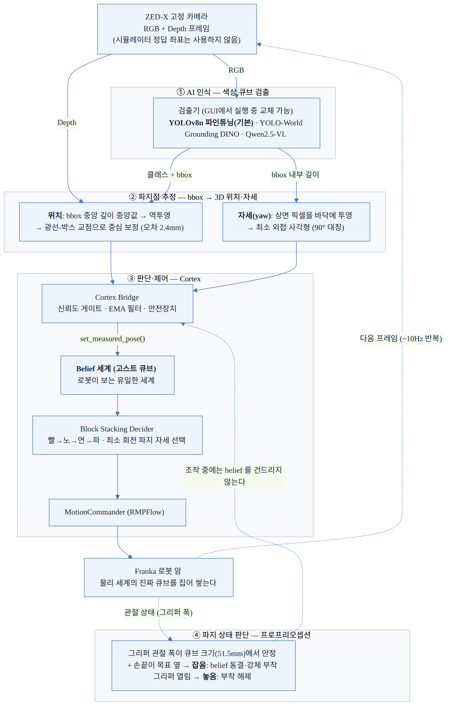
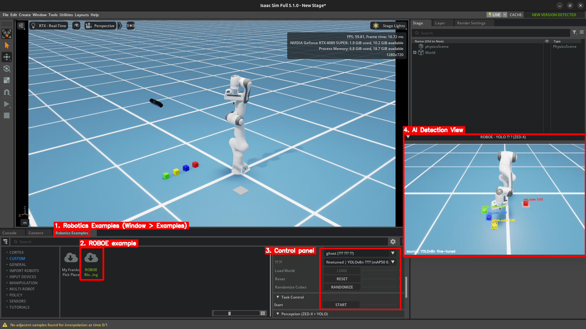
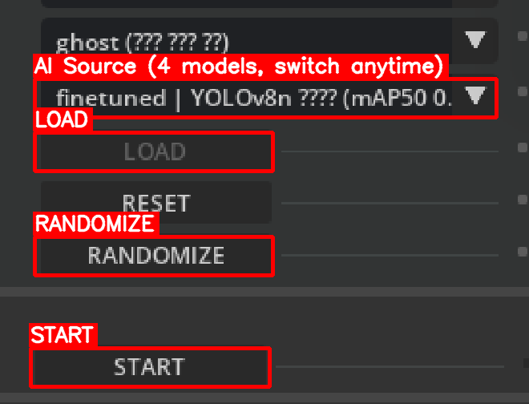

# [Take-home Task] AI Vision 기반 Block Stacking

Isaac Sim 5.1 환경에서

고정된 **ZED-X RGB-D 카메라**와 **AI 검출 모델**만으로 색상 큐브 4개를 인식.

**Franka 암**이 **빨강 → 노랑 → 연두 → 파랑** 순서로 사용자가 지정한
위치에 쌓는 프레임워크. 


**제출물** :

- [**소스코드**](소스코드.md)
- [**구현 설명 문서**](구현설명문서.md)
- [**실행 영상**](실행영상.md)


## Result 

> **결과 측정 방식** — AI Perception 4종 × 큐브 배치 2종, 총 8개 경우의 수에 대한 각각 10회 성공/실패여부


AI기반 Perception 방식은 YOLO+SDG 외에 VLM기반 3가지 방식 총 4가지 방식으로 했고, 각각의 성능을 비교하고자 하였으며

기본적으로 인식을 수행해서 빨, 노, 연, 파 순서대로 쌓는것에 대해
과제에 명세된 환경으로는, 이 4가지 방식의 성능을 비교하기 어려워


문제의 상황을 조금더 실제 환경처럼 구성 (Advanced Ver.)해서도 함께 비교해서 풀었습니다.


| 기본 배치 (과제 명세) | 랜덤 배치 (Advanced Ver.) |
| :---: | :---: |
| [](media/demo/demo_default.mp4) | [](media/demo/demo_random.mp4) |
| 큐브 4개 일자 정위치 | 위치·회전 무작위 + 초기 belief 를 평균 36cm 오염시켜 시작 (인식이 교정해야 성공하는 조건) |


(클릭하면 고화질 mp4 원본이 나옵니다)


같은 파이프라인에서 인식 소스만 바꿔 두 배치를 각 10회씩 돌린 성공률.
랜덤 배치는 seed 를 고정해서 4개 소스가 동일한 10개 배치로 평가됨:

| 인식 소스 | 기본 배치 | 랜덤 배치 |
| --- | :---: | :---: |
| **YOLOv8n 파인튜닝** ✅ 기본 | **10/10** | **10/10** |
| Grounding DINO (tiny) | **10/10** | 4/10 |
| Qwen2.5-VL-3B | **10/10** | **10/10** |
| YOLO-World v2 (s) | 6/10 | 7/10 |


## AI Perception 소스별 대표 영상

4편 모두 큐브 배치 배치에서 성능을 비교하여
소스 간 직접 성공/실패 여부를 비교가능 (ZED 카메라 시점 + 검출 오버레이):


| YOLOv8n 파인튜닝 (10/10 · 10/10) | Grounding DINO (10/10 · 4/10) |
| :---: | :---: |
| [](media/demo/demo_random.mp4) | [](media/demo/infer_gdino.mp4) |
| **Qwen2.5-VL-3B (10/10 · 10/10)** | **YOLO-World v2 (6/10 · 7/10)** |
| [](media/demo/infer_qwen.mp4) | [](media/demo/infer_yoloworld.mp4) |

- 실패 13회는 전부 특정 큐브 인식 실패로 인한 정지 후 타임아웃(100초).
- YOLO+SDG 방식 기준 완주 시간: 기본배치 평균 25.6초 / 랜덤배치(Advanced Ver.) 평균 22.0초. 완성 탑의 중심 정렬
  오차 최대 5.3mm (큐브 한 변 51.5mm), AI 인식 → 3D 위치 오차 평균 2.4mm
- 원자료: `media/e2e/<소스>_<배치>/trials.csv` (회당 시간·파지 횟수·게이트 통계)

## 전체 흐름

Camera Vision 1Hz당 ①→④를 반복. 

단계별 로직 상세는 각 링크 문서에 기재함.


- **[① AI 인식](docs/01_perception.md)** — RGB 데이터로부터 큐브의 Class (색), 그리고 Bounding Box를 검출
- **[② 파지점 추정](docs/02_grasp_point.md)** — Bounding Box + Depth로 Position (x, y, z)과 Orientation(yaw)을 추정.
- **[③ 판단·제어](docs/03_decision_control.md)** — Perception 결과를 안전장치(신뢰도 게이트 · EMA 필터 · 조작 중 동결 · 작업공간 게이트 · 탑 보호)로 걸러 로봇이 인식하는 Belief 쪽 데이터를 갱신하고, 다음 행동을 유도 로봇을 움직임
- **[④ 파지 판단](docs/04_grasp_state.md)** —그리퍼 관절 폭(프로프리오셉션)으로 "잡았다/놓았다"를 스스로 판정




기본 Base는 Isaac Sim 내장 Franka **Cortex** 예제(Block Stacking, Apache-2.0).

통합 지점은 Cortex 가 인식 연동용으로 제공하는 `CortexObject.set_measured_pose()`
API 하나이고, 의사결정 로직은 쌓기 순서 설정 외에는 수정하지 않음.

## 핵심 — AI 인식 4종 실측 비교

과제의 핵심인 ① AI 인식을 **네 가지 방식으로 구현**하고, 같은 검증 이미지 300장 ·
같은 채점 코드로 실측 비교함. 네 방식 모두 GUI 드롭다운으로 **실행 중 전환**됨.

| 인식 소스 | 방식 | mAP50 | pick 정확도* | 지연/장 |
| --- | --- | --- | --- | --- |
| **YOLOv8n 파인튜닝** ✅ 기본 | 폐쇄셋 학습 (합성 데이터) | **0.999** | **0.999** | **7 ms** |
| Grounding DINO (tiny) | zero-shot 검출기 | 0.878 | 0.873 | 177 ms |
| Qwen2.5-VL-3B | zero-shot 생성형 VLM | 0.820† | 0.867† | 3,852 ms |
| YOLO-World v2 (s) | zero-shot 실시간 검출기 | 0.680 | 0.697 | 13 ms |

(\*) pick 정확도 = "클래스별 최고 신뢰도 1개를 집는다"는 정책이 실제 그 색 큐브에 맞은
비율. 쌓기 성공을 가장 직접 예측하는 지표. (†) 장당 약 4초라 30장 서브셋으로 측정.
비교 그림: [`media/figures/zeroshot_compare.png`](media/figures/zeroshot_compare.png)

분석 요약:

- 파인튜닝을 기본으로 채택. 클래스가 고정된 실시간 제어 루프 조건에서 전 지표 우위.
  학습 데이터는 Replicator 합성 train 2,800장 (수동 라벨링 0장, mAP50 0.9949),
  배포는 TorchScript 라 Isaac Sim 환경에 추가 패키지 없음
- zero-shot 공통 약점: 연두↔노랑 같은 미세 색 구분에서 흔들림 (연두→노랑 오인 67회),
  프롬프트 민감도가 큼 ("green"→"light green" 변경만으로 mAP50 0.525→0.680),
  신뢰도 보정이 안 되어 있어 고정 threshold 를 그대로 못 씀
- 오프라인 지표와 E2E 성공률이 일치하지 않음 (위 결과 표). 기본 배치는 mAP 순서와
  비슷하지만 (GDINO/Qwen 10/10, YOLO-World 6/10), 랜덤 배치에서는 mAP 0.878 인
  GDINO 가 4/10 로 떨어지고 가장 느린 Qwen(~0.2Hz)이 10/10. 정확도/지연/신뢰도
  보정/안전장치가 함께 작용하기 때문에 E2E 실측 없이는 판단이 어려움. YOLO-World
  실패는 대부분 3번째 큐브(연두) 재검출 정체로, 오프라인에서 확인된 연두 혼동과
  원인이 같음
- 결론은 대체가 아니라 역할 분담. 정답 라벨이 없는 실환경에서는 zero-shot 을
  auto-labeling 에 쓰고, 소형 파인튜닝 모델을 실시간 추론에 쓰는 구성이 자연스러움

각 방식별 입력 Prompt (원문 그대로):

**YOLO-World** — 클래스 어휘 목록. 실행 전에 한 번만 CLIP 으로 임베딩해서 모델에
bake 함 (그래서 빠름):

```python
["red cube", "yellow cube", "light green cube", "blue cube"]
```

**Grounding DINO** — 마침표로 구분한 캡션 한 줄. 매 프레임 텍스트를 같이 인코딩:

```python
"a red cube. a yellow cube. a green cube. a blue cube."
```

**Qwen2.5-VL** — 챗봇형 모델이라 출력 형식까지 지정한 지시문:

```python
"Detect every small colored cube in this image. There are up to four cubes: "
"red, yellow, green (light green), and blue. "
'Output ONLY a JSON array like [{"bbox_2d": [x1, y1, x2, y2], "label": "red cube"}] '
"with one entry per cube. No other text."
```

(YOLOv8n 파인튜닝은 폐쇄셋 학습이라 Prompt 없음. 클래스가 학습으로 고정됨)

채점 코드는 `eval/zeroshot/`, 인식 파이프라인 구현은
`isaac_ext/roboe_block_stacking/perception/` 에 있음.

## 직접 실행하기 (inference 재현)

**요구 환경**: Ubuntu 22.04+, NVIDIA RTX GPU(검증: RTX 4080 SUPER 16GB), 드라이버 550+,
최초 실행 시 인터넷. 모든 스크립트는 저장소 상대 경로만 사용함.

```bash
# 1) Isaac Sim (최초 1회)
conda create -n isaacsim_roboe python=3.11 -y && conda activate isaacsim_roboe
pip install "isaacsim[all,extscache]==5.1.0" --extra-index-url https://pypi.nvidia.com

# 2) 런타임 설치 (NVIDIA Omniverse EULA 동의 포함) — 학습된 모델이 저장소에
#    포함되어 있어 여기까지면 바로 실행 가능
bash scripts/setup_runtime.sh

# 3) zero-shot 백엔드 3종
bash scripts/setup_zeroshot.sh
```

**GUI 실행**: `isaacsim` → Window → Examples → Robotics Examples → Custom →
**ROBOE Block Stacking** → `Tower X/Y` 입력 → `LOAD` → `Start`



컨트롤 패널 확대 (AI Source / LOAD / RANDOMIZE / START):



- **인식 소스 드롭다운** — 4종을 실행 중 전환 (신뢰도 게이트 자동 조정, GDINO/Qwen 은
  첫 선택 시 가중치 자동 다운로드)
- **AI 검출 뷰 창** — 검출기가 보는 이미지 + 박스/점수 실시간 표시
- **Randomize Cubes** — 실행 중 큐브 재배치 → 인식이 재검출로 따라잡는 과정 확인
- **Perception On/Off** — 끄면 로봇이 기본 위치의 고스트로 감 (인식 의존성 확인)

**GUI 없이 (배치 평가·재현)**:

```bash
python standalone/run_stacking_perception.py                  # 기본 배치 E2E 쌓기
python eval/run_trials.py --backend gdino --layout random     # 소스/배치 골라 10회 평가
bash eval/run_e2e_matrix.sh                                   # 위 성공률 매트릭스 전체 재현
```

zero-shot 성능 비교 재현: `eval/zeroshot/run_*.py` → `summarize.py` (학습 venv,
`scripts/setup_zeroshot.sh` 가 구성).

---

베이스: Isaac Sim Franka Cortex Examples (Apache-2.0). 과제 명세 PDF 는 저장소에
포함하지 않음 (발제사 소유).
