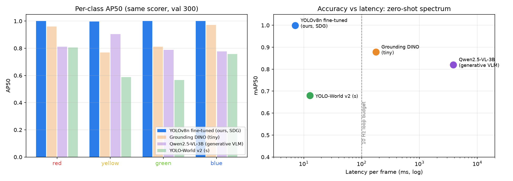
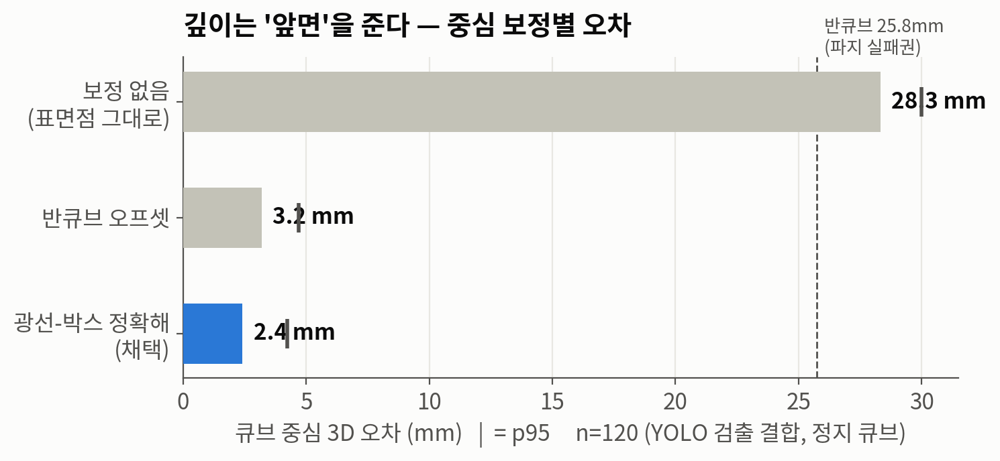
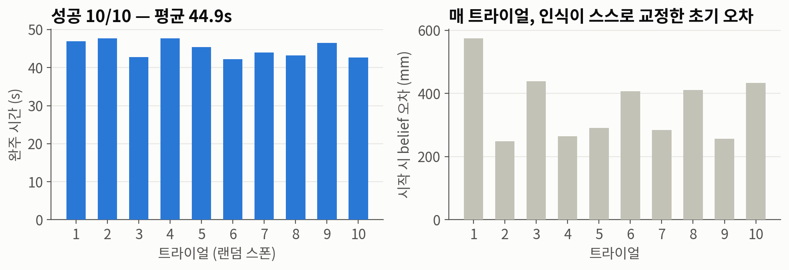

<!-- _class: lead -->

# AI Vision 기반 Block Stacking

### ZED-X RGB-D + YOLOv8n + Franka Cortex — 인식만 보고 동작하는 로봇

<br>

**한 줄 요약** — "인식을 만들었다"가 아니라
**"인식만 보고 동작하는 로봇을 만들었고, 그것을 증명했다"**

<!--
발표 30분 = 본편 22~24분 + 데모 4분 + 버퍼.
첫 장에서 차별점 선언: 증명 가능한 구조(ghost belief)가 이 발표의 등뼈.
-->

---

## 1. 요구사항 분해 — 사실과 해석을 구분

| 구분 | 내용 |
|---|---|
| **사실** (명세) | Isaac Sim 5.1, Franka Cortex Examples 베이스, ZED-X 고정 자세, RGB-D + **AI 모델 필수**, 빨→노→연→파, 적재 위치 사용자 지정 |
| **해석** (문서화) | "집기 순서 = 쌓는 순서" → 탑 아래부터 빨·노·연·파 |
| **해석** (문서화) | 예제 GreenCube 색을 연두로 조정 — 검출기는 우리가 렌더한 색으로 학습하므로 무위험 |
| **판단** ("필요 시") | Orientation 추정 — **필요성을 실측으로 입증한 후** 구현 (뒤에서) |

<!--
평가자가 좋아하는 것: 명세를 그대로 읽지 않고 사실/해석/판단을 구분해 문서화했다는 점.
"필요 시"를 실측으로 판단한 이야기는 슬라이드 10에서 회수.
-->

---

## 2. 전략 — AI 를 붙이기 전에 기하부터 검증

```
M0 스톡 재현 → M1 카메라+역투영(AI 없이 0.8mm) → M2 GT 스태킹(인식 OFF)
→ M3 합성데이터+학습 → M4 in-sim 인식(2.4mm) → M5 인식 기반 E2E
→ M6 배치 평가(22%→100%) → M7 문서/발표
```

- 매 단계 **검증 게이트** 통과 후 진행 — 실패 시 원인 계층이 자동으로 좁혀짐
- M1 게이트가 핵심: **AI 투입 전** 기하 체인(역투영·좌표계·보정)을 GT 픽셀로 검증
  → 이후 모든 오차는 "검출기 몫"으로 귀속 가능

<!--
디버깅 방법론의 복선. M6 의 22%→100% 이야기에서 "계층이 좁혀진다"가 반복된다.
-->

---

## 3. 아키텍처 — Vision → Perception → Manipulation

```
ZED-X (고정, Kinematic) ──RGB──▶ YOLOv8n (TorchScript, ~10Hz) ──bbox+cls──▶
        └──Depth─────────────────────────────────────────────▶ 3D 추정기
                                                  (중앙 깊이 median → 역투영 → 광선-박스 보정 → yaw)
                                                                  │ (p, q)
                                                                  ▼
                                             Cortex Bridge (게이팅·부착·보호 7종)
                                                                  ▼
      [Belief 세계] 고스트 큐브 4개 (렌더 OFF) ← 로봇이 보는 유일한 세계
                                                                  ▼
                    Block Stacking Decider Network → RMPFlow → Franka
                                        (물리 세계의 진짜 큐브를 집는다)
```

<!--
계층 분리 강조: 이후 모든 수정이 "어느 계층의 문제인가"로 설명된다.
-->

---

## 4. Cortex 의 숨은 이음새 — `set_measured_pose()`

- Cortex 는 인식 연동용 API 를 **설계해 두었다**: `CortexObject.set_measured_pose()`
  behavior 의 `monitor_perception()` 이 measured pose 를 belief 로 동기화하는 로직 내장
- 그런데 **설치본 전체에서 호출처 0곳** — 우리가 이 이음새를 채웠다
- 의사결정 로직 수정: 쌓기 순서 `order_preference` 한 줄 + 오늘 다룰 강건성 수정 2건
  → **"프레임워크를 읽고, 설계 의도대로 통합했다"**

<!--
베이스 예제를 지정한 출제 의도 = 남의 프레임워크를 읽는 능력 평가로 추정된다고 말할 것.
-->

---

## 5. 차별점 — Ghost Belief 구조

**물리 큐브를 그대로 등록하면 (direct):**
- 인식을 꺼도 완벽 동작 → 인식 기여를 **증명할 수 없다**
- 실측: 인식 동기화가 물리 큐브를 순간이동시켜 조작 자체를 교란 (발행 32회 만에 실패)

**렌더 OFF 고스트만 등록하면 (ghost, 채택):**
- 로봇은 고스트(=인식 결과)만 보고 계획, 물리적으로는 진짜 큐브를 집음
- **인식 오차 = 파지 오차** → 파이프라인 동작이 구조적으로 증명됨
- 배치 평가는 belief 를 **평균 361mm 오염시키고 시작** — 인식이 교정해야만 성공

<!--
이 장이 발표의 심장. "증명 가능한 구조를 설계했다"는 주장의 근거.
-->

---

## 6. 합성 데이터 — 런타임 분포를 덮는 랜덤화

- Replicator 로 train 2,800 + val 300 (**다른 시드**), 박스 12,357개, 라벨링 비용 0
- 학습 씬 = 런타임 씬과 **같은 코드**(`scene_setup.py`), **같은 카메라** → 도메인 갭 원리적 차단
- 랜덤화 설계: 큐브 흩어짐 60% / **부분 탑 40%** (스태킹 중 분포), 로봇 관절,
  조명 세기·색·방향, 카메라 지터 ±2cm/±2°, **그리퍼 파지 장면 보충** (운반 중 검출)
- 시점 랜덤화는 **의도적 최소** — 카메라가 고정이라는 문제 조건을 데이터 설계에 반영

<!--
"왜 이 랜덤화인가"에 근거가 있다는 것. 부분 탑 40%는 스태킹 과정의 분포를 덮기 위함.
-->

---

## 7. 검출기 — 선택 근거와 결과

| 후보 | 판단 |
|---|---|
| **YOLOv8n 파인튜닝** ✅ | 4클래스·고정 시점에 충분, 추론 수 ms, SDG 로 라벨링 0원 |
| HSV 임계처리 | **"AI 모델 활용" 조건 미충족**, 조명 취약 |
| Faster R-CNN | 추론 ~10배 느림 → fallback 으로 유지 |
| Zero-shot (G-DINO) | 연두 vs 노랑 미세 구분 신뢰성 불확실 → **다음 장에서 실측** |

**결과**: mAP50 **0.9949** / mAP50-95 **0.9695** · 노랑↔연두 혼동 **600중 1** · 미검출 0
**배포**: 학습 venv 분리, TorchScript + 직접 디코드, parity 게이트 **IoU 1.00000 (33/33)**

<!--
mAP50-95를 끝까지 올린 이유: bbox 중심이 곧 3D가 된다. 1px ≈ 2.3mm.
배포 분리: ultralytics 의존성이 Isaac 환경을 깨는 리스크 차단. torch 2.7.0 양쪽 고정.
-->

---

## 8. 확장 — zero-shot 으로 되나? 같은 채점기로 실측



- 학습 0(프롬프트만) 3계열 vs 채택 모델 — **같은 val 300장·같은 채점기**: 0.68~0.88 vs **0.999**
- 연두→노랑 혼동 **67회**(G-DINO) · 프롬프트 민감도 0.53→0.68(YOLO-World) — 기각 사유가 **수치**가 됨
- 결론: **대체가 아니라 역할 분담** — runtime 은 파인튜닝 소형 모델, zero-shot 은 실환경 **auto-labeling(교사) → 증류(학생)**

<!--
"VLM 같은 걸로 zero-shot 대안 제시" 요청에 대한 직답 장표.
- pick 정확도 = 브리지 정책(클래스별 최고 신뢰도 1개 픽)이 진짜 그 색 큐브에 맞은 비율 — 스태킹 성공 직결.
- Qwen2.5-VL(진짜 VLM)은 색 판단 최강(혼동 3/120)이지만 3.9s/장 — 루프가 아니라 오프라인 분석/라벨링용.
- 신뢰도 무보정: zero-shot 전원 conf 0.25 게이트에서 전멸 — 게이트 재설계 없인 브리지에 못 꽂는다.
- 예상 반문 "비교가 불공정(한쪽만 도메인을 봤다)" → 맞다, 그게 논점: "도메인을 아는 비용(SDG 30분,
  라벨링 0원)을 치를 가치가 있는가"를 잰 실험. 폐쇄셋·10Hz 루프에선 가치가 있다(+0.12, 지연 1/25).
  도메인이 열려 있으면(신규 객체) 저울이 반대로 기운다.
-->

---

## 9. 3D 추정 — "깊이는 앞면을 준다"



- 깊이를 그대로 쓰면 평균 **28.3mm** 오차 (큐브 반변 25.8mm — **파지 실패권**)
- 광선-박스 교점의 정확해 `t = h / max(|û_x|,|û_y|,|û_z|)` → **2.4mm** (n=120, p95 4.2)
- 오차 분해: 기하 체인 0.8mm (픽셀 양자화) + 검출기 1.6mm (실루엣 중심 편차)

<!--
시스템 오차를 발견→모델링→보정→정량화한 과정 자체가 어필 포인트.
-->

---

## 10. Yaw 추정 — "필요 시"가 필요해진 순간

**필요성의 실측 입증**: 랜덤 yaw 평가에서 정렬 가정 파지가
45° 큐브의 **대각 모서리를 쳐내** 큐브가 날아가는 실패 발생

**방법** (YOLO 는 회전을 모른다 — Depth 가 준다):
1. bbox 안 깊이 픽셀 역투영 → 3D 점구름
2. 상면 1.5cm 슬라이스 → xy 투영 → `cv2.minAreaRect` 회전각 (**mod 90°**, 정육면체 대칭)
3. 신뢰 게이트: 상면 변 길이가 실물(5.15cm)과 다르면 폐기 (가림/오검 방어)

<!--
"AI가 어디까지 하고 기하가 어디부터 하는가" 역할 분담 질문이 나오면 여기로 회수.
-->

---

## 11. 통합 원칙 — "조작 중에는 belief 를 건드리지 않는다"

| Bridge 안전장치 | 막는 실패 (전부 실측) |
|---|---|
| 신뢰도 게이트 + 클래스별 1개 | 유령/중복 검출 |
| EMA + 대점프 스냅(2연속 일관) | 지터 / 초기 대오차 수렴 |
| 데드밴드 8mm | 목표 미세이동 → 도달 판정 불가 (100초 정체) |
| 조작 중 동결 + **프로프리오셉션 강체 부착** | 접근 중 목표 흔들림 / 운반 중 belief |
| 작업공간 게이트 | 가림 오검의 불가능한 3D |
| 탑 보호 (반경 32mm, **무예외**) | 배치 직후 오검 1발의 탑 파괴 |
| 슬립 detach | 빠진 큐브의 공중 고스트 고착 |

파지 판정 = 시뮬레이터 정보가 아니라 **그리퍼 관절 폭** (실기 이식 가능)

<!--
12회 통합 실험에서 실패마다 계측으로 규명하며 도달한 원칙. 표의 오른쪽 열이 전부 실측이라는 점 강조.
-->

---

## 12. 과제 요구 vs 실제 검증 범위

| 항목 | 과제 요구 | 본 구현 검증 |
|---|---|---|
| 초기 배치 | 예제 기본 (고정) | **랜덤 위치+yaw** (r 0.40~0.75) |
| belief 초기값 | 제약 없음 | **평균 361mm 오염 시작** |
| 인식의 역할 | 색+3D 인식 | ghost — **인식 오차=파지 오차** |
| Orientation | "필요 시" | 필요성 실측 입증 후 구현 |
| 증빙 | 영상/스크린샷 | + **N=10 정량 평가** |

"**한 번 되는 것**과 **항상 되는 것**은 다른 문제" — 강건성 결함은 전부 이 조건이 끌어냈고,
명세 조건만 검증했다면 **데모 중에 처음** 만났을 결함들

<!--
본연 시나리오(스톡 배치)는 M5에서 5연속 완주로 별도 검증. 요구 축소가 아니라는 방어선.
-->

---

## 13. 강건성 여정 — 배치 평가 22% → 100%

```
22% ──① EMA 초기수렴/동결충돌/yaw 모서리 → 스냅·동결예외·yaw 추정──▶ 70%
70% ──② 좀비존/슬립 → 반경 정합·슬립 detach ──────────────────────▶ 80%
80% ──③ 마커 자기관측 → 3D 마커 제거 ─────────────────────────────▶
    ──④ 베이스 접선 평형 → carry-high ────────────────────────────▶
    ──⑤ 손목-베이스 감김 → 최소 회전 배치 자세 ────────────────────▶ 100%
```

모든 단계가 같은 방법론: **고밀도 계측 → 고정 재현 → 원인 확정 → 원리적 수정 → 재검증**

<span class="small">결정적 재현 수단: 시드 42 트라이얼 2 — 세 런 연속 같은 지점에서 실패 → 스폰+yaw 까지 rng 스트림 복원으로 단독 재현</span>

<!--
다음 3장이 사례 ③④⑤. 시간 부족하면 ③만 상세히, ④⑤는 한 문장씩.
-->

---

## 14. 사례 ① 디버그 마커의 자기 관측

**증상**: 배치된 노랑의 belief 가 탑을 이탈했다가, 로봇이 다가가면 복귀 (?)

**원인** (통제 실험으로 확정): 뷰포트 디버그 점이 **ZED 렌더에도 찍힘**
→ YOLO 가 노란 점을 `yellow_cube 0.93` 으로 오검 → 인식이 자기 마커를 쫓는 **표류 루프**
→ 로봇이 접근하면 팔이 마커를 가려 진짜가 재검출 = "복귀"의 정체

**수정**: 3D 마커 **완전 제거** → 대체: **YOLO 검출 뷰 창** (캡처 후 주석 = 되먹임 구조적 불가)

> 교훈: **디버그 오버레이도 센서가 보는 세계의 일부다**

<!--
운영자의 육안 관찰("작은 점이 큰 점을 따라다닌다")이 단서였다는 것도 언급 — 계측과 관찰의 상보성.
-->

---

## 15. 사례 ② 운반 경로의 보이지 않는 벽

**증상**: 특정 트라이얼에서 EE 가 **항상 정확히 (0.32, 0.10)** 에서 정지

**원인**: 오른쪽 파지 → 왼쪽 탑 운반의 직선 경로가 로봇 **베이스에 r≈0.33 으로 접선**
→ 탑 인력과 베이스 **자기충돌 배리어** 척력의 평형점
→ 장애물 해제 무력(배리어는 등록 장애물이 아님), posture 섭동 무력(null-space)

**수정**: **carry-high** — 탑에서 멀면 목표 z 를 0.32 로 (위로-넘어-내려오기, 히스테리시스)
사람 작업자의 "높이 들고 운반"과 같은 원리

<!--
r>=0.40 작업공간 가설을 세웠다가 같은 좌표 재실패로 기각한 것도 정직하게 언급 가능 (시간 되면).
-->

---

## 16. 사례 ③ 손목-베이스 감김 데드락

**증상**: 탑 위 6cm 까지 와서 착지 못 하고 5cm 폭으로 영구 선회

**원인** (관절 계측): 스톡의 배치 자세가 **월드 -y 고정 선호** — 랜덤 yaw(74.9°) 파지 후
이 요구가 손목 가동범위 밖 → 운반 중 **q7 여유 1.1→0.04** (한계) → RMPFlow 가
부족한 회전을 **베이스로 보상** → q0 도 감김 → 위치-자세 트레이드오프 데드락

**수정**: 큐브는 90° 대칭 = 배치 자세 후보 4개가 물리적으로 동일
→ **현재 손목에서 최소 회전** 후보 선택 (요구 비틀림 ≤45° 로 유계 — 감김 원리적 불가)

**핵심**: 컨트롤 계층(배리어·RMPFlow) **무수정** — 이산 선택은 decider 의 일 (Cortex 계층 분업)

<!--
singularity 아님(자코비안 정상, joint limit + 제약 국소최소). "한계를 지켰기 때문에 멈춘 것".
채점 한 줄 diff: dot([0,-1,0], T_x) → dot(eff_x, T_x).
-->

---

## 17. 정량 결과 종합



| 지표 | 값 |
|---|---|
| 배치 평가 (랜덤+오염 시작) | **10/10 (100%)**, 평균 44.9s, 탑 오차 ≤7.4mm |
| 인식 정확도 (정지 120측정) | 평균 **2.4mm** / p95 4.2mm / 미검출 0 |
| 추론 지연 | 단독 2.2ms / 렌더 동시 **27ms (12배)** → 10Hz 설계 근거 |

<!--
최대 오염 574mm 트라이얼도 탑 오차 2.4mm — "반 미터를 스스로 교정".
지연 12배는 GPU 공유 실측 — 발행 주기 설계가 감이 아니라 측정에서 나왔다는 것.
-->

---

## 18. 데모

**영상** `media/demo/demo_stacking.mp4` — 실시간 배속
[3인칭 뷰 | ZED + YOLO 오버레이] · 랜덤 스폰 → 스태킹 → **중간 라이브 Randomize**
(belief 가 뒤처졌다 재획득으로 따라잡는 장면) → 완성

**라이브** (시간 허용 시):
1. LOAD → 검출 뷰 창 + Perception 패널
2. Depth 보정 none → 추정 3cm 치우침 ("깊이는 앞면")
3. Start → 완주 → **Randomize 버튼** → **큐브 드래그** → **Perception OFF 대비**

<!--
라이브 실패 시 폴백 멘트: "영상으로 보시겠습니다". 리허설 3회 연속 성공 후에만 라이브 선택.
-->

---

## 19. 한계와 확장 — 정직하게

**한계**
- 탑 반경 32mm 내 드래그 추적 불가 — 탑 보호와의 의도된 트레이드오프
- 파지 실패 복구는 behavior 반응성에 의존 (전용 재시도 로직 없음)
- 중립색 UI 요소의 OOD 리스크 — 실측 완화, 원리 해법은 distractor 랜덤화 학습

**확장**
- sim2real: `zed_camera.py` 데이터 소스만 교체 (계층 분리 설계) + 랜덤화 확장
- 스테레오 현실 깊이(SingleViewDepthSensor)로 오차 열화 실험

**베이스 예제에 되돌려준 것**: 잠재 결함 3건 발견·수정 (reload 싱글톤, belief 검증,
고정 배치 자세의 감김) — 회귀 테스트 동반

<!--
한계를 먼저 말하면 Q&A가 편해진다. 각 한계에 "왜 그렇게 남겼는지" 근거가 있음.
-->

---

<!-- _class: lead -->

## 마무리

**요구**: 카메라와 AI 로 큐브를 인식해 쌓아라
**구현**: 인식만 보고 동작하는 로봇 — belief 를 반 미터 오염시켜도 **10/10**

<br>

> 모든 주장에 실측 수치를, 모든 결정에 기각된 대안을.

<br>

감사합니다 — Q&A

<!--
Q&A 대비: vault 51 노트 30+ 문항 (감김/singularity, 흰색도 OOD 아닌가, YOLO만으로 yaw 되나,
컨트롤러 튜닝했나, ghost가 치팅 아닌가, sim2real 등).
-->
