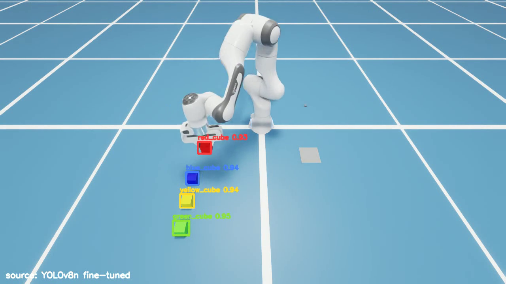
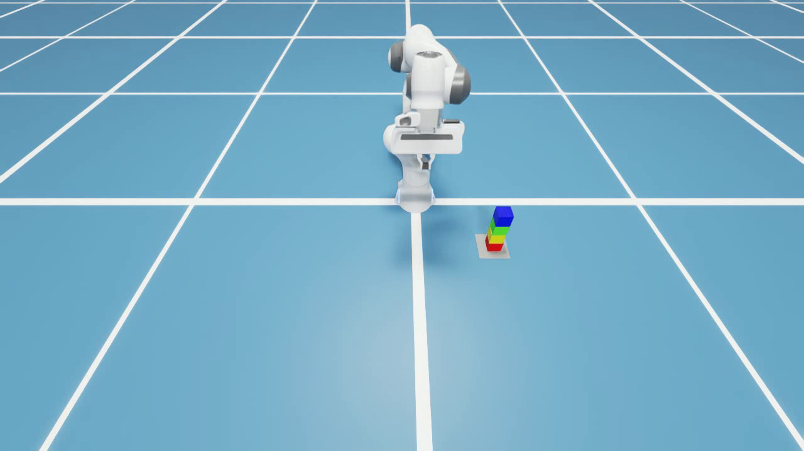

# 제출물 ③ 실행 영상

모든 영상은 **ZED-X 카메라 시점 + AI 검출 박스 오버레이** (좌하단에 인식 소스 표기).
클릭하면 재생됨.

## 데모 2편 — 기본 배치 / 랜덤 배치

| 기본 배치 (과제 명세 그대로) | 랜덤 배치 (스트레스) |
| :---: | :---: |
|  |  |
| 큐브 4개 일자 정위치 → 빨→노→연→파 쌓기 완주 | 위치·회전 무작위 + 초기 belief 평균 36cm 오염 → 인식이 교정하며 완주 |

## 인식 소스별 대표 영상 4편

4편 모두 **같은 랜덤 배치**(같은 seed)에서 해당 소스가 실제 완주한 회차 — 직접 비교 가능.

| 인식 소스 | 영상 | 성공률 (기본 / 랜덤, 각 10회) |
|---|:---:|:---:|
| YOLOv8n 파인튜닝 | [▶ 재생](media/demo/demo_random.mp4) | 10/10 · 10/10 |
| Grounding DINO (tiny) | [▶ 재생](media/demo/infer_gdino.mp4) | 10/10 · 4/10 |
| Qwen2.5-VL-3B | [▶ 재생](media/demo/infer_qwen.mp4) | 10/10 · 10/10 |
| YOLO-World v2 (s) | [▶ 재생](media/demo/infer_yoloworld.mp4) | 6/10 · 7/10 |

- 성공률 원자료(회당 시간·파지 횟수·게이트 통계): `media/e2e/<소스>_<배치>/trials.csv`
- 영상 재생성: `python eval/run_trials.py --backend <소스> --layout <배치> --trials 1 --record`
