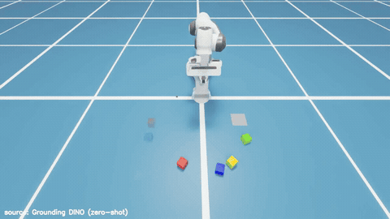
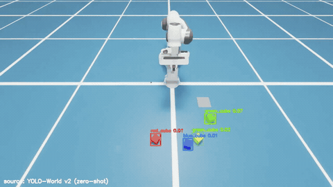

# 제출물 ③ 실행 영상

모든 영상은 ZED-X 카메라 시점 + AI 검출 박스 오버레이 (좌하단에 인식 소스 표기).
GIF 는 자동 재생 미리보기이고, 클릭하면 고화질 mp4 원본으로 이동함.

## 데모 2편 — 기본 배치 / 랜덤 배치

| 기본 배치 (과제 명세) | 랜덤 배치 (Advanced Ver.) |
| :---: | :---: |
|  |  |
| 큐브 4개 일자 정위치 → 빨→노→연→파 쌓기 완주 | 위치·회전 무작위 + 초기 belief 평균 36cm 오염 → 인식이 교정하며 완주 |

## 인식 소스별 대표 영상 4편

4편 모두 같은 랜덤 배치(같은 seed)에서 실제 완주한 회차라 직접 비교가 됨.
성공률 원자료: `media/e2e/<소스>_<배치>/trials.csv` ·
영상 재생성: `python eval/run_trials.py --backend <소스> --layout <배치> --trials 1 --record`

### YOLOv8n 파인튜닝 — 기본 10/10 · 랜덤 10/10

### Grounding DINO (tiny) — 기본 10/10 · 랜덤 4/10

### Qwen2.5-VL-3B — 기본 10/10 · 랜덤 10/10

### YOLO-World v2 (s) — 기본 6/10 · 랜덤 7/10

